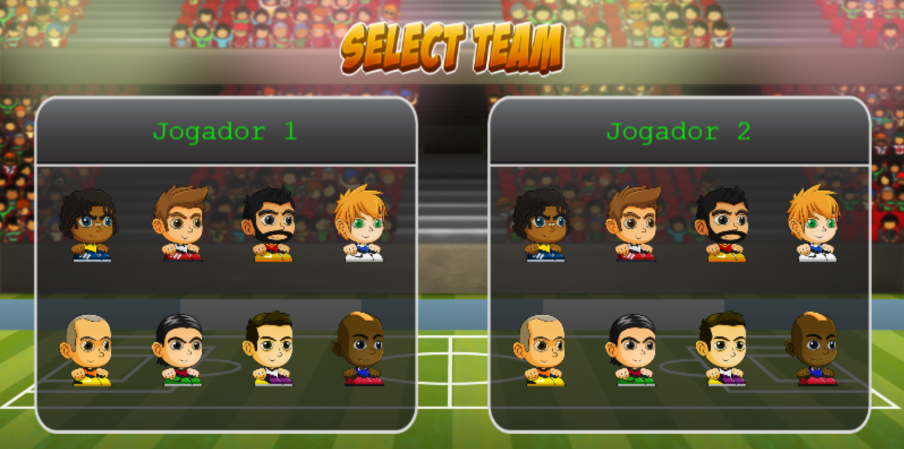
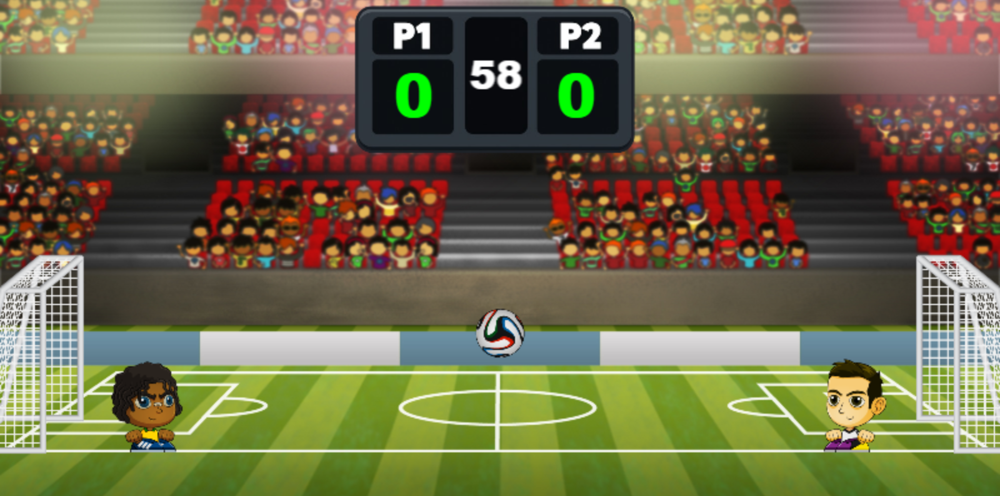
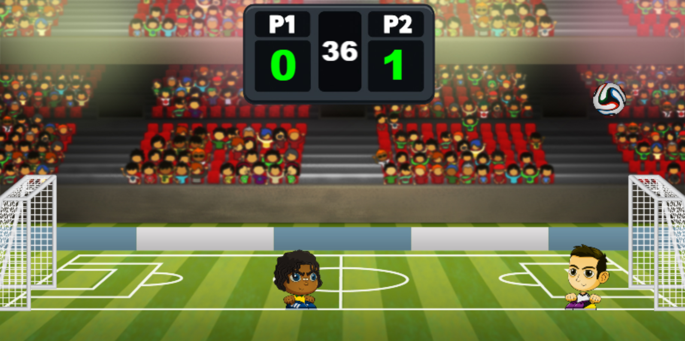
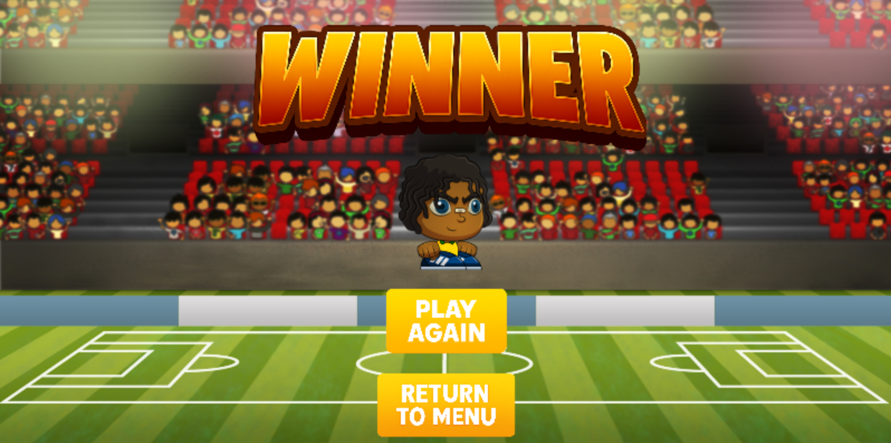

# Soccer Head ⚽

**Soccer Head** é um jogo 2D local desenvolvido com **Phaser**, inspirado em jogos arcade de futebol para dois jogadores.

O projecto implementa uma partida rápida no mesmo teclado, com selecção de personagens, física de bola, colisões, golos, marcador, temporizador, prolongamento em caso de empate e ecrã final com opções para repetir a partida ou regressar ao menu.

---

## Funcionalidades

* Menu inicial com opção para jogar e consultar instruções;
* selecção de personagens para os dois jogadores;
* oito personagens disponíveis com sprites e animações;
* modo local para dois jogadores no mesmo teclado;
* movimento, salto e remate para ambos os jogadores;
* bola com física Arcade, colisões e ressaltos;
* balizas com detecção de golo;
* marcador e temporizador de 60 segundos;
* prolongamento automático em caso de empate;
* ecrã final com vencedor, opção para repetir a partida e voltar ao menu.

---

## Demonstração

### Selecção de personagens

<p align="center">
  
</p>

### Início da partida

<p align="center">
  
</p>

### Partida com golo

<p align="center">
  
</p>

### Ecrã final

<p align="center">
  
</p>

---

## Controlos

| Jogador   | Movimento              | Saltar         | Rematar         |
| --------- | ---------------------- | -------------- | --------------- |
| Jogador 1 | `A` / `D`              | `W`            | `S`             |
| Jogador 2 | Setas esquerda/direita | Seta para cima | Seta para baixo |

---

## Arquitectura

O jogo está organizado em cenas Phaser, separando o menu, instruções, selecção de personagens, partida e ecrã final.

```text
.
├── Assets/              # Imagens, personagens, bola, balizas, botões e cenário
├── cenas/               # Cenas Phaser do jogo
├── game.js              # Configuração principal do Phaser
├── index.html           # Página HTML principal
└── phaser.min.js        # Biblioteca Phaser incluída localmente
```

### Cenas principais

| Cena          | Responsabilidade                                           |
| ------------- | ---------------------------------------------------------- |
| `Cena1`       | Carregamento de assets e criação das animações.            |
| `CenaMenu`    | Menu inicial e instruções.                                 |
| `CenaSelecao` | Escolha das personagens dos jogadores.                     |
| `Cena2`       | Lógica principal da partida, física, golos e temporizador. |
| `CenaFim`     | Ecrã final, vencedor e navegação.                          |

---

## Tecnologias

* **HTML5** — estrutura da aplicação;
* **JavaScript** — lógica do jogo e controlo das cenas;
* **Phaser** — motor 2D para renderização, input, animações e física;
* **Phaser Arcade Physics** — colisões, gravidade, bola, jogadores e balizas;
* **Assets PNG/JPG** — personagens, cenário, botões e elementos visuais.

---

## Como executar

O projecto é uma aplicação web estática. Não tem backend, processo de build ou gestor de dependências configurado.

A partir da raiz do repositório, correr:

```bash
python -m http.server 8000
```

Depois abrir no browser:

```text
http://localhost:8000
```

Também pode ser usado qualquer servidor HTTP estático, como a extensão **Live Server** do VS Code.

> Em sistemas sensíveis a maiúsculas/minúsculas, confirma que os caminhos no `index.html` correspondem exactamente aos nomes das pastas e ficheiros.

---

## Estado do projecto

Projecto académico desenvolvido para o **TP2 de Phaser**.

A versão actual implementa a estrutura completa de um jogo arcade local, incluindo cenas, assets, animações, física, jogabilidade para dois jogadores, marcador, temporizador e ecrã final.

---

## Autor

* [Simão Sousa](https://github.com/simaosousa10)
